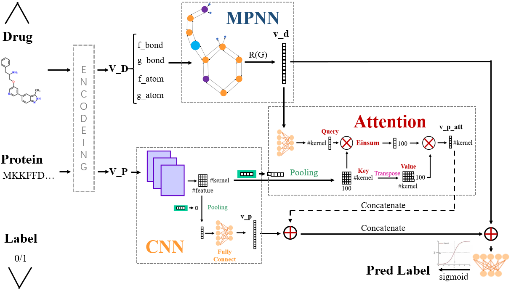
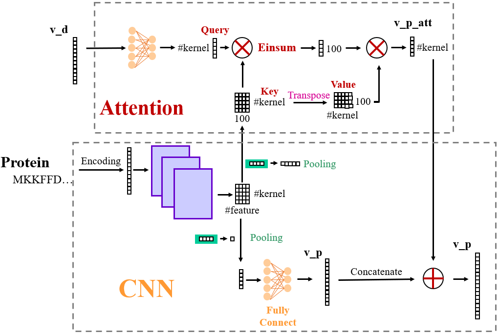
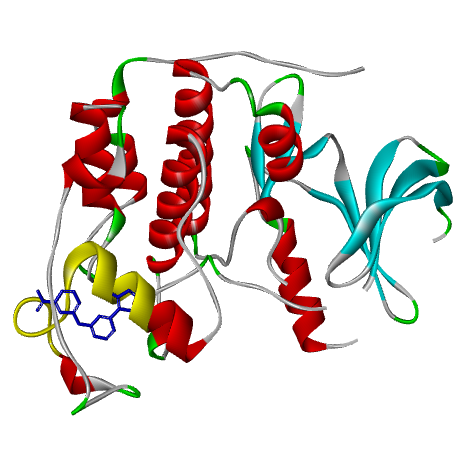
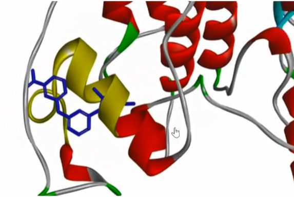

# Drug-Target Interaction Prediction
This is the course project for EI314-Bioinformatics
Image segmentation is the process of assigning a label to every pixel 
in an image such that pixels with the same label share certain visual characteristics. 
In this project, we try to solve the problem in ISBI challenge where a full stack of EM slices will be used to train 
machine learning algorithms for the purpose of automatic segmentation of neural structures.
The images are representative of actual images in the real-world, containing some noise and small image alignment errors. 
None of these problems led to any difficulties in the manual labeling of each element in the image stack by an expert 
human neuroanatomist. 

The aim of the challenge is to compare and rank the different competing methods based on their
pixel and object classification accuracy. The accuracy of segmentation is very important for medical images, because 
the edge segmentation error 
will lead to unreliable results, in that case it will be rejected for clinical application.
Obtaining these sample images to train the model may be a resource consuming process because of the need for high-quality, 
uncompressed and accurately annotated images reviewed by professionals.
Therefore, the algorithm designed for medical imaging must achieve high performance and accuracy with less data samples.

# Models and methods

In this project, we implemented
- [DeepDTA](https://arxiv.org/pdf/1505.04597.pdf)
- [DeepCDA](https://arxiv.org/pdf/1807.10165.pdf)
- [Moltrans](https://arxiv.org/pdf/1903.02740.pdf)
- [MAC]

# MAC
The data description is same with ISBI Challenge except that we split the raw train data set (consist of 30 samples) into two parts: the new train set and new
test set. The downloaded data set consists of 30 samples, 25 for train and 5 for test. We simply train our model on the newly split data sets and did not use pre-training models. 

Here is one example for training data (raw image and corresponding label):
## MAC

<table>
  <tr>
    <td></td>
  </tr>
</table>

## MPNN

<table>
  <tr>
    <td></td>
  </tr>
</table>

## Attention-CNN

<table>
  <tr>
    <td></td>
  </tr>
</table>
 
# Visualization of Drug-target Interaction

For the fact that the training data size is too small (we have only 25 training images),
we apply image augmentation by:

```
from keras.preprocessing.image import ImageDataGenerator

datagen = ImageDataGenerator(rotation_range=20, shear_range=0.2, width_shift_range=0.2, height_shift_range=0.2,
                                 zoom_range=0.2,
                                 vertical_flip=True, horizontal_flip=True, fill_mode='constant', cval=0)
```
After that, we get an augmented dataset of **10000** images. Here is one example for augmented training data:
<table>
  <tr>
    <td></td>
    <td></td>
  </tr>
 </table>


## Requirements

- `tensorflow`
- `pytorch`
- `python 3.6+`
- `numpy`
- `matplotlib`
- `torch`
- `keras`
- `glob`
- `os`
- `pandas`
- `sklearn`
- `rdkit`
- `pickle`


# Group Members

Shengyuan Hou

Yifan Liu

Chun Chi
