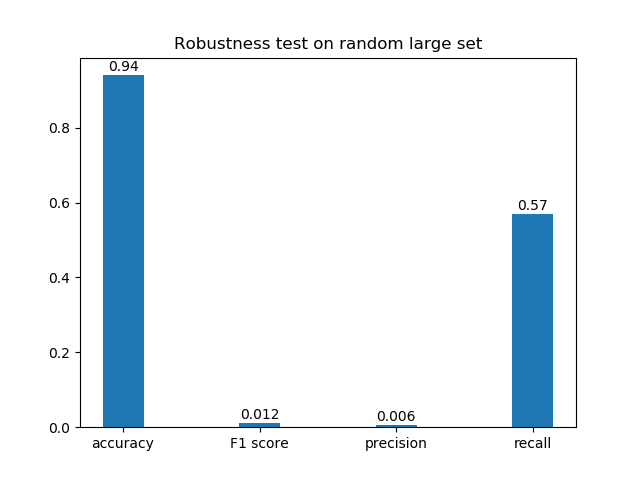

# Drug-Target Interaction Prediction
This is the course project for EI314-Bioinformatics

Drug Target Interaction (DTI) prediction now has attracted a large number of scholars to dig in because of its potential practical values including shortening drug development cycle, exploring new applications of existing drugs and providing personalized drugs recommendation for patients. The existing DTI research methods include Docking method, Similarity Based method and Deep Learning. 

Here, our research group raised a new frame called MAC, which combines Message Passing Neural Network(MPNN) and Attention enhanced CNN respectively for the encoding of Drugs and Proteins. MAC has outstanding ability to learn and extract the spatial features of drug molecules and excellent ability to accurately locate proteins' action sites because of MPNN and attention mechanism so that MAC achieved Accuracy=0.99 and F1=0.98 on the first **100,000** pairs of dataset provided by TA. Subsequent control variate experiments, robustness test and visualization verified the structural effectiveness, strong robustness and great interpretability of MAC.

# Test examples 


```
from keras.preprocessing.image import ImageDataGenerator

datagen = ImageDataGenerator(rotation_range=20, shear_range=0.2, width_shift_range=0.2, height_shift_range=0.2,
                                 zoom_range=0.2,
                                 vertical_flip=True, horizontal_flip=True, fill_mode='constant', cval=0)
```

# Models and methods

In this project, we implemented
- [DeepDTA](https://arxiv.org/pdf/1505.04597.pdf) (By Shengyuan Hou Using tensorflow)
- [DeepCDA](https://arxiv.org/pdf/1807.10165.pdf) (By Chun Chi Using tensorflow)
- [Moltrans](https://arxiv.org/pdf/1903.02740.pdf) (By Yifan Liu Using tensorflow)
- [MAC] (By Shengyuan Hou Using pytorch)

# MAC
After reproducing MolTrans, DeepDTA and DeepCDA mentioned above and analyzing their merit and demerit, we propose our own model for DTI prediction named MAC inspired by [DeepPurpose](https://github.com/kexinhuang12345/DeepPurpose) Library, which means the combination of MPNN(Message Passing Neural Network), Attention Mechanism and CNN. To describe more clear, we use MPNN to fetch drugs' representation vector and attentioned CNN to that of proteins. Then we combine two representation vectors and use fully connected layers and dropout layers to output our results

Here are the overall architecture and detailed description of every single part:
## MAC

<table>
  <tr>
    <td></td>
  </tr>
</table>

## MPNN

<table>
  <tr>
    <td></td>
  </tr>
</table>

## Attention-CNN

<table>
  <tr>
    <td></td>
  </tr>
</table>
 
# Visualization of Drug-target Interaction

By outputing Attention Layer's weight distribution, our research group achieved the visualization of the action sites of specific protein and drug with the power of Discovery Studio.

The output of Attention Layer has the same size as the embedding of proteins. And the higher weight means certain part of the protein and the given drug has greater interactive force, which can be taken as action site. In the following two figures , yellow part of protein denotes potential interaction site and blue molecule is the chosen drug. 

<table>
  <tr>
    <td></td>
    <td></td>
  </tr>
 </table>

# Real-world Test

Here we simulate the approximate distribution of TA-provided dataset. It is composed of 1,500 randomly sampled positive pairs+ 2,500,000 randomly sampled negative pairs.

<table>
  <tr>
    <td></td>
  </tr>
</table>
 
# Requirements

- `tensorflow`
- `pytorch`
- `python 3.6+`
- `numpy`
- `matplotlib`
- `torch`
- `keras`
- `glob`
- `os`
- `pandas`
- `sklearn`
- `rdkit`
- `pickle`


# Group Members

Shengyuan Hou

Yifan Liu

Chun Chi
